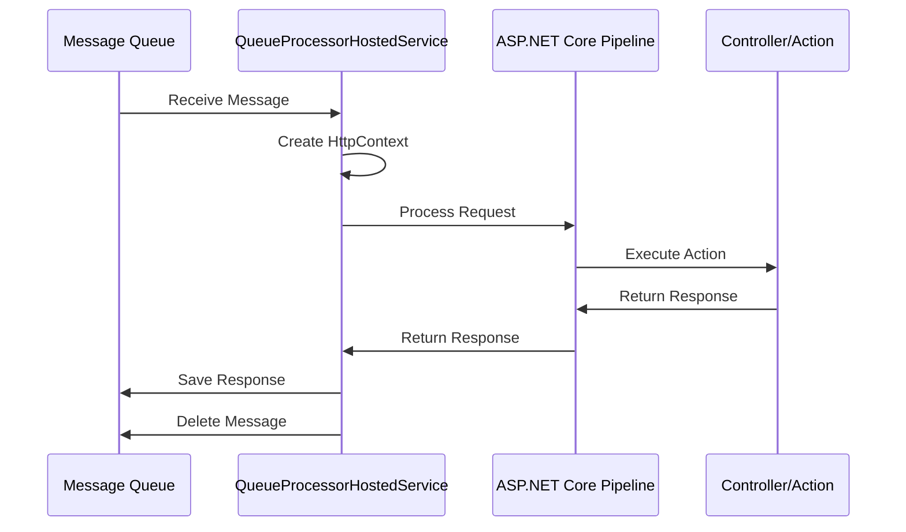

# ESP.QueueProcessor

ESP.QueueProcessor is a powerful framework that bridges the gap between message queues and ASP.NET Core's request processing pipeline. It allows you to leverage all ASP.NET Core features (middleware, dependency injection, filters, etc.) for processing events from databases or message brokers.

## Overview

The project provides a way to process messages from various sources (databases, message brokers) using the familiar ASP.NET Core request pipeline. This means you can:

- Use existing ASP.NET Core middleware
- Leverage dependency injection
- Apply filters and attributes
- Use controllers and actions
- Handle authentication and authorization
- And more...

## Architecture

The project consists of several key components:

1. **IMessageQueueService**: Interface defining the contract for message queue services
2. **DatabaseQueueService**: PostgreSQL-based implementation of the message queue
3. **QueueProcessorHostedService**: Background service that processes messages using ASP.NET Core pipeline
4. **RequestDelegateHolder**: Holds the ASP.NET Core request delegate for processing messages

## Process Flow



## Database Schema

The project uses two main tables:

1. **requests**:
   - Id (UUID)
   - Method (string)
   - Path (string)
   - QueryString (string, nullable)
   - Headers (JSONB)
   - Body (text, nullable)
   - Processed (boolean)
   - Created_at (timestamp)

2. **responses**:
   - RequestId (UUID)
   - StatusCode (integer)
   - Headers (JSONB)
   - Body (text, nullable)
   - Created_at (timestamp)

## Getting Started

1. Configure your PostgreSQL connection string in `appsettings.json`
2. Create the required database tables
3. Register the services in `Startup.cs`:
   ```csharp
   services.AddSingleton<IMessageQueueService, DatabaseQueueService>();
   services.AddSingleton<RequestDelegateHolder>();
   services.AddHostedService<QueueProcessorHostedService>();
   ```

## Usage

1. Create your ASP.NET Core controllers and actions as usual
2. Messages will be processed through the same pipeline as HTTP requests
3. Responses will be saved back to the queue for later retrieval

## Benefits

- **Familiar Development Model**: Use existing ASP.NET Core knowledge
- **Full Pipeline Support**: All middleware and features are available
- **Scalable**: Multiple consumers can process messages concurrently
- **Reliable**: Database-backed queue ensures message persistence
- **Flexible**: Easy to implement different queue providers

## License

This project is licensed under the MIT License - see the [LICENSE](LICENSE) file for details.